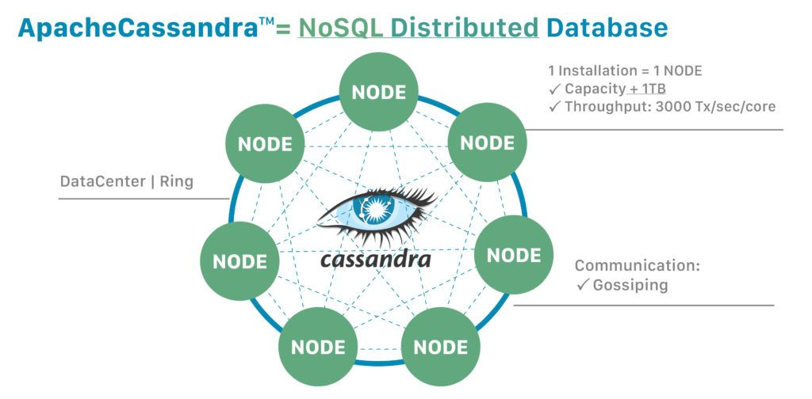

# cassandradb-intro

CassandraDB - Distributed DB

CQL(Cassandra Query Language) - мова запитів, альтернатива класичній SQL.

Написана JAVA, але є альтернатива ScyllaDB, написана на C++.

## Структура
### Ноди(партішини)

[nodetool](https://cassandra.apache.org/doc/latest/cassandra/tools/nodetool/nodetool.html)

### Хеш

### Memtables і SSTable(Sorted Strings Table)

Кожна таблиця зберігається в своєму окремому файлі.

## Модель даних

- Спочатку запит потім запис данних.
- Кожна таблиця зберігається в своєму окремому файлі, тому повʼязанні данні мають знаходитися в одній таблиці.
- Денормалізація.

## Переваги

- CassandraDB - відкрите програмне забезпечення(Open Source).
- Висока доступність(High availability) без простоїв.
- Нема мастер ноди. There is no single point of failure.
- Автоматична реплікація і реплікація між дата центрами.
- Горизонтальне масштабування.
- Додавання партішинів(нод) однією командою.
- Карти, кортежи і JSON в полях.

## Недоліки

- AP база по CAP теоремі. Кінцева консистенція (Eventual Consistency). Читання данних не гарантує повернення останніх змін.
- Надгробки(Tombstones): limit - 100K cells.
- Незмінний ключ розбиття(Partition Key).
- Індекси https://docs.datastax.com/en/cql-oss/3.3/cql/cql_using/useWhenIndex.html#Whennottouseanindex
- Матеріалізовані Представлення(Materialized Views) в беті.
- JAVA(використання памяті, збирання сміття)

## Обмеження

- Максимальний кількість партішинів(нодів) в теорії не обмежена. Netflix має приблизно 1000 нод.
- Максимальний кількість значень полів(записів х поля) на один партішин - 2 000 000 000
- Максимальний розмір значення поля - 2GB

## Різниця між реляційними базами і CassandraDB
https://cassandra.apache.org/doc/latest/cassandra/data_modeling/data_modeling_rdbms.html

### Розбиття(Partitioning)

RDB - мануальне(в коді).

CassandraDB - автоматичне на основі хеша від ключа розбиття(Partition Key).

### Масштабування

- RDB - вертикальне.
- CassandraDB - горизонтальне.

### З'єднання(JOINs)

Не має з'єднань.

### Підзапити

Не має підзапитів і CTE.

### Зовнішній ключ

Немає зовнішніх ключів.

### Денормалізація

Данні мають бути денормалізовані.

## Replication factor

## Consistency level

Cassandra is typically classified as an AP system, meaning that availability and partition tolerance are generally considered to be more important than consistency in Cassandra, Writes and reads offer a tunable level of consistency, all the way from "writes never fail" to "block for all replicas to be readable", with the quorum level in the middle.

## Приклади

### Створення схеми

### Створення таблиці

#### Матеріалізоване Представлення(Materialized Views)

### Вставка данних

## Tombstones
COW
https://en.wikipedia.org/wiki/Tombstone_(data_store)

## More to read
https://www.baeldung.com/cassandra-keys
Документація - https://cassandra.apache.org/doc/latest/index.html
Курси - https://www.datastax.com/dev/academy
